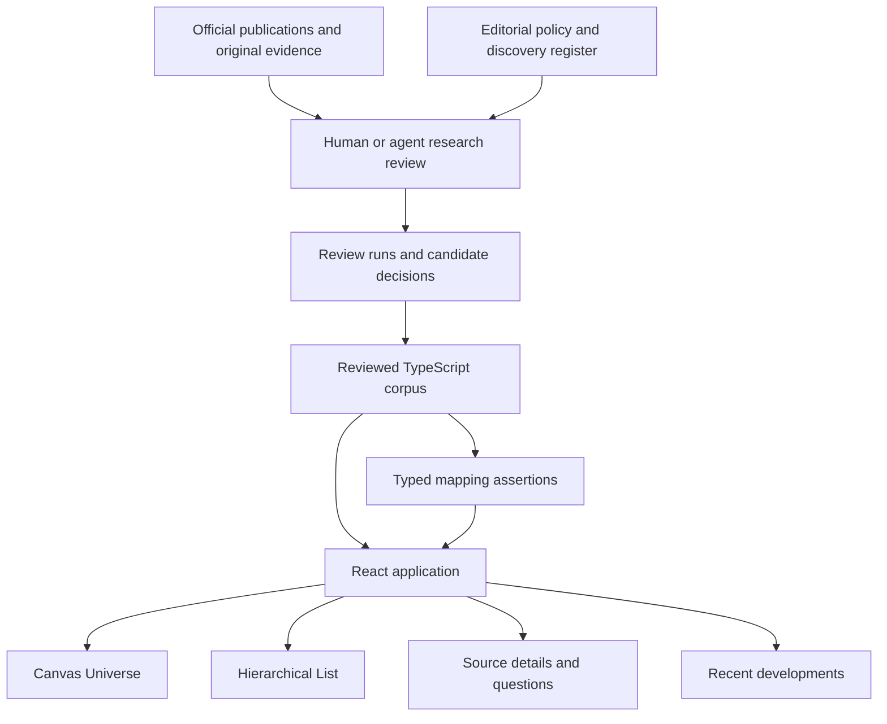
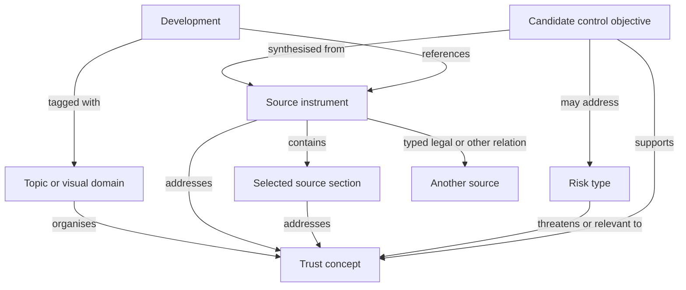
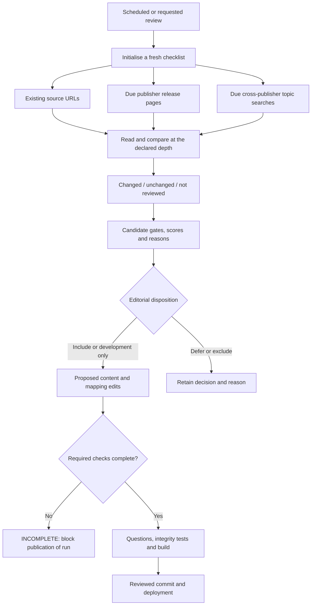
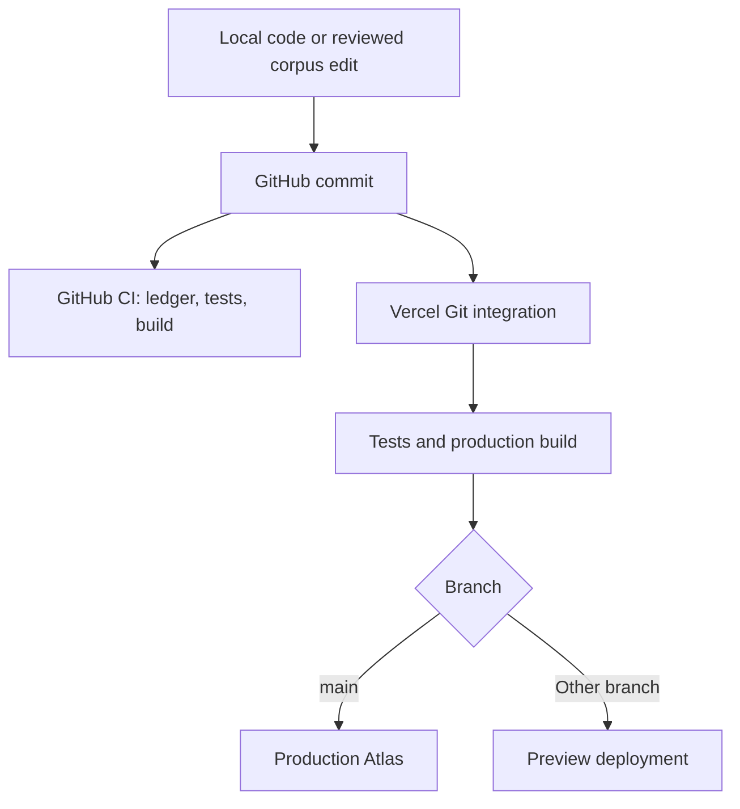
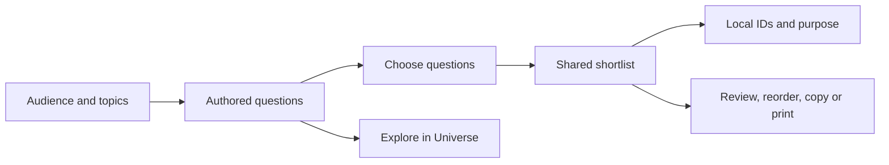
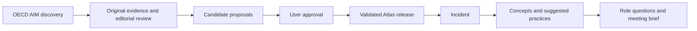

# AI Trust Atlas

**A source-linked knowledge map that turns a complex topic into something people can explore, question and use.**

[Open the Atlas](https://ai-trust-atlas.vercel.app) · [Source methodology](research/sourcing/README.md) · [Monitoring playbook](MONITORING.md) · [Prompt catalogue](docs/PROMPTS.md) · [MIT licence](LICENSE)

AI Trust Atlas connects AI governance concepts with laws, guidance, standards, research, risks and candidate controls. Its Universe makes the landscape explorable; its hierarchical List makes it readable. Source cards explain the material, role-specific questions help prepare conversations, and meeting briefs help readers prepare evidence-based discussions.

The initial audience is regulators, boards and executive leaders, with particular attention to Australia and financial services. The implementation is also a blueprint for a reference application on another topic: keep the rendering and evidence model, then replace the taxonomy, source corpus, editorial rules and audience questions.

> This is a reference and planning tool. Connections do not establish legal applicability, compliance, implemented controls, operating effectiveness, residual risk or assurance. Those judgments belong to accountable people.

## Contents

1. [What you can do](#what-you-can-do)
2. [Architecture at a glance](#architecture-at-a-glance)
3. [Run it locally](#run-it-locally)
4. [The knowledge model](#the-knowledge-model)
5. [How the interface works](#how-the-interface-works)
6. [Source selection and authority](#source-selection-and-authority)
7. [How new material enters the Atlas](#how-new-material-enters-the-atlas)
8. [Prompts, schedules and cron jobs](#prompts-schedules-and-cron-jobs)
9. [GitHub and Vercel deployment](#github-and-vercel-deployment)
10. [Build an Atlas on another topic](#build-an-atlas-on-another-topic)
11. [Verification, limits and next steps](#verification-limits-and-next-steps)

## What you can do

| Experience | Purpose | Implementation |
|---|---|---|
| Universe | Explore sources, concepts, risks and controls spatially, with selection emphasis and source provenance | Custom Canvas 2D renderer with projected 3D positions |
| List | Browse the same objects hierarchically or go directly to an alphabetical source directory | Accessible React tree with canonical node IDs and appearance-specific paths |
| Source inspector | Read summaries, scope, source links, legal foundations and related material | Components backed by the compiled source corpus |
| Questions to ask | Prepare Board, Executive or Regulator conversations and collect a meeting brief | Authored question banks and deterministic composition, not live model generation |
| What’s new | Review developments within 30, 90 or 120 days | Editorially curated event records filtered by publication date |
| Light / dark | Preserve topic colours in either theme | CSS variables, saved preference and theme-aware Canvas rendering |

At the September 2026 documentation snapshot, the corpus contains 78 sources and 40 trust concepts. The risk layer has seven MIT domains and 24 risk types; the control layer has six Atlas families and 24 objectives. These are versioned content counts, not a completeness score. The build currently checks questions across 296 Atlas cards and 20 developments; consult the actual build output as the corpus evolves.

## Architecture at a glance



**The core is a compiled knowledge application.** Content is maintained as TypeScript and JSON in Git, built by Vite, and delivered as static assets. Browsing does not call an LLM or query a graph database. The graph is assembled from arrays and maps in the browser.

The application is static and has no application API or live model calls. There is no crawler running inside the web app, vector database, retrieval-augmented chat service, shared organisation database or automatic legal decision engine.

### Main layers and files

| Layer | Key files | Responsibility |
|---|---|---|
| Contracts | [`src/types.ts`](src/types.ts) | Instruments, concepts, provisions, risks, controls, citations, assertions and graph nodes |
| Source corpus | [`src/data/instruments.ts`](src/data/instruments.ts), regional/source modules and dated refresh modules | Compose the canonical source array; apply targeted corrections and section additions |
| Ontology | [`src/data/concepts.ts`](src/data/concepts.ts), [`controls.ts`](src/data/controls.ts), [`mitRiskTaxonomy.ts`](src/data/mitRiskTaxonomy.ts) | Topics, shared concepts, risk taxonomy and candidate control objectives |
| Relationships | [`src/data/relations.ts`](src/data/relations.ts), [`assertions.ts`](src/data/assertions.ts) | Source-to-source links, typed assertions, explanations and ranked risk paths |
| Navigation models | [`src/lib/graphModel.ts`](src/lib/graphModel.ts), [`outlineModel.ts`](src/lib/outlineModel.ts), [`workspace.ts`](src/lib/workspace.ts) | Filtered graph, deterministic coordinates, tree appearances, search and bounded path exploration |
| App state | [`src/App.tsx`](src/App.tsx) | Selection, filters, view transitions, dialogs and URL navigation |
| Rendering | [`GraphCanvas.tsx`](src/components/GraphCanvas.tsx), [`UniverseOutline.tsx`](src/components/UniverseOutline.tsx), [`Inspector.tsx`](src/components/Inspector.tsx) | Universe, List and source-detail experiences |
| Questions | [`leadershipQuestions.ts`](src/data/leadershipQuestions.ts), [`nodeQuestionPrompts.ts`](src/data/nodeQuestionPrompts.ts), [`nodeQuestions.ts`](src/data/nodeQuestions.ts) | Authored prompts and audience-specific composition |
| Developments | [`src/data/developments.ts`](src/data/developments.ts), [`TemporalLens.tsx`](src/components/TemporalLens.tsx) | Event metadata and recent-development feed |
| Editorial operations | [`research/sourcing/`](research/sourcing/), [`scripts/source-review.ts`](scripts/source-review.ts) | Discovery register, candidate decisions and review completeness checks |

## Run it locally

Use a supported Node.js release compatible with Vite. The deployed Vercel project uses Node 24; Node 22 was also used for local validation. Dependency versions are locked in `package-lock.json`.

```bash
git clone https://github.com/9to5ai/ai-trust-atlas.git
cd ai-trust-atlas
npm ci
npm run dev
```

Open the local URL printed by Vite. No API key is required.

```bash
npm run typecheck          # TypeScript checks
npm test                   # Vitest: data, model, UI and endpoint tests
npm run questions:check    # All required cards and audiences have complete questions
npm run build              # Question gate, TypeScript and Vite output
npm run preview            # Serve the built static app locally
npm run sources:review     # Validate the ledger and report due checks; no research occurs
```

Vite serves the complete application locally. No backend service or runtime API credentials are needed.

## The knowledge model



### Objects have stable identities

Canonical navigation IDs include `instrument:apra-cps-230`, `concept:accountability`, `provision:<id>`, `risk-subdomain:<id>` and `control-objective:<id>`. A source can appear under several concepts in the List while still opening the same source record. Its tree appearance has a separate path key, so expanding one branch does not redefine its identity.

A source record separates:

- **Identity and origin:** title, issuer, official URL and stable ID.
- **Authority and scope:** source type, authority note, jurisdiction, sectors and applicability description.
- **Time and status:** publication date, effective date where known, status and last verification date.
- **Review depth:** full public text, public summary or licensed-standard metadata.
- **Content:** original synopsis, concept IDs and selected sections with their own locators and review notes.

[`instruments.ts`](src/data/instruments.ts) composes base records, regional sources, dated additions and explicit correction overlays. These overlays do not automatically reverify the rest of a source. Section-level review dates can differ from the parent record.

### Connections carry reasons and evidence

A `MappingAssertion` stores source and target IDs, predicate, rationale, basis, confidence, citations, author, verification date, status and inference depth. The three provenance bases are:

| Basis | Meaning |
|---|---|
| `source-authored` | The relationship is attributed to the source itself |
| `published-crosswalk` | A published mapping connects the materials |
| `atlas-synthesis` | The Atlas authors interpret the relationship |

Assertions are partly generated deterministically from curated concept IDs, source references and relationship records. This generation expands editorial input into a navigable model; it is **not** independent verification. High confidence is an editorial label, not a measured probability. Default or inherited verification dates must not be confused with a fresh review of every assertion.

The navigation layer adds explicit containment edges for source sections and risk taxonomy structure. Graph position, topic colour and visual proximity carry no legal force. Paths may navigate in either direction for exploration, but retain each assertion’s original direction and meaning.

A source-to-risk path often travels through a concept or section. Path ranking is a navigation heuristic; it is not a risk score, control coverage calculation or finding that the source mitigates the risk. The bounded path search avoids using topic groupings as shortcuts between unrelated records.

## How the interface works

### Universe and List are two projections of one corpus

1. `App.tsx` holds filters, the active lens and canonical selected ID.
2. `buildGraphModel()` selects relevant records and creates deterministic target coordinates and edges. Stable hashing helps preserve layout between renders.
3. `GraphCanvas` projects x/y/z coordinates onto Canvas 2D, applies camera scale and rotation, draws depth-aware nodes and labels, and handles hit testing and keyboard navigation. This is custom projected geometry, not a Three.js scene or a force-directed graph database.
4. `buildOutline()` makes the corresponding topic, risk or control hierarchy. Source browsing can instead use a flat alphabetical source directory with expandable sections.
5. Universe and List capture visible node screen positions. A Motion overlay animates matching canonical IDs between views; remaining rows and nodes transition into place. Selected objects continue to use the same inspector.
6. Reduced-motion preferences, tree keyboard controls and mobile sheet dismissal support different ways of navigating.

Search indexes the compiled objects and uses text matching, not embeddings. The List ranks sources within a concept partly by the number of supporting sections; direct source browsing is alphabetical. Neither ranking should be read as an authority assessment.

### Motion that supports exploration

The centre has a restrained 6.4-second halo cycle. Separate detail and ambient clocks let hover or selection stabilise the orbit while the halo and selection accents remain responsive. Selecting or hovering an item produces a single 1.5-second light cue along up to twelve visible connections; it is a selection aid, not a claim about semantic direction or live activity.

Filtered nodes and edges crossfade over roughly 360 milliseconds. Exiting objects are retained only for drawing, not hit testing, and quick filter reversals reuse their current opacity and position. Pause freezes decorative motion; reduced-motion preferences settle transitions immediately and disable the reveal cue. Reduced-motion changes are observed while the app is open. The hidden List view stops the Canvas loop.

### Questions and developments

The question bank is maintained in source files. `questionsForNode()` composes role-specific prompts from authored concept, risk, control and source material. Each question carries context, the question, why it matters, evidence to ask for, a follow-up and references. The build enforces coverage and distinct wording for Board, Executive and Regulator audiences.

“What’s new” reads curated development records rather than scraping the internet when opened. It filters publication dates into 30/90/120-day windows, with topic filters and links back to sources. A new source node, a newly reviewed old publication and a new real-world event are different things; old material must not become “news” merely because it was added to Git.

### State and styling

Ordinary navigation is React state with URL-based selection. Theme and audience preferences use browser storage. Meeting preparation and other UI state should be treated as local rather than a shared service.

The visual design combines base styles with feature styles and an Arctic/light and dark colour system. Canvas colours are coordinated with CSS through theme-aware rendering. For a new topic, preserve accessible contrast and stable category colours rather than giving every node a new decorative style.

## Source selection and authority

**Source type describes form; authority depends on the claim, remit and scope.** A regulator’s binding instrument, its speech and a research paper should not inherit the same legal status because they come from a prestigious publisher.

The current source types are Laws & regulations, Treaties, Policy & guidance, Standards, Frameworks, Testing & tools, and Research & databases. The `authorityClass` field is a historical code name for that classification; read it alongside `authorityNote`, scope and status. For example, an APRA prudential standard can be binding within its scope, while APRA commentary is not itself the same kind of instrument.

[`sourcingPolicy.ts`](src/data/sourcingPolicy.ts) supplies one rubric to the Methodology UI and candidate assessor:

| Factor | Weight | Question |
|---|---:|---|
| Authority for the claim | 30% | Is this the responsible institution or strong original evidence for this claim? |
| Audience relevance | 30% | Does it matter to the target readers and jurisdictions? |
| Decision impact | 25% | Could it change a question, assessment or action? |
| Distinct contribution | 15% | Does it add substantive value beyond existing coverage? |

Each factor is scored 0–4 with a written reason. The total is `sum(score × weight / 4)`, producing 0–100. This prioritises review effort; it is not an admission threshold or certification. Relevant binding changes receive mandatory review priority regardless of novelty, but cannot bypass the evidence gates.

Before inclusion, the candidate must pass **provenance, evidence, rights, and scope/status** gates and have a recorded reviewer, date and review depth. The assessor rejects include/development-only decisions without those prerequisites.

| Disposition | Use it when |
|---|---|
| Include | There is supported, distinct and lasting reference value |
| Development only | The event is useful news but can link to an existing source node |
| Defer | Access, evidence, date, scope or status remains unresolved |
| Exclude | It is duplicative, out of scope, promotional without useful evidence, or lacks decision value |

Official publication is a provenance advantage, not automatic admission. Original technical research can be valuable without legal force. Licensed ISO/IEC/IEEE material is represented at permitted public-metadata/summary depth; do not reproduce licensed clauses. Search snippets and secondary reporting can identify leads but do not substitute for the required source review.

The full rubric anchors, review depths and examples are in [the sourcing guide](research/sourcing/README.md). [Candidate decisions](research/sourcing/candidate-decisions.json) preserve reasons and reassessments; `supersedesId` records a new decision rather than silently rewriting its predecessor.

## How new material enters the Atlas



The [discovery register](research/sourcing/discovery-register.json) defines publisher endpoints and cross-publisher topic searches. Existing corpus URLs are added to each checklist automatically. Weekly items become due after seven days; the current script treats monthly discovery as a rolling 28-day interval, not calendar-month scheduling. Entries without a review date are due immediately.

```bash
# 1. Report due work and validate candidate decisions; no sources are fetched.
npm run sources:review

# 2. Create a unique run. This refuses to overwrite an existing file.
npm run sources:review -- init research/sourcing/run-YYYY-MM-DD.json

# 3. Perform actual research; record evidence and decisions in the JSON files.
#    The CLI does not perform this step for you.

# 4. Check the completed run. Any unreviewed/missing required check fails.
npm run sources:review -- check research/sourcing/run-YYYY-MM-DD.json

# 5. Validate supported edits before publishing.
npm run questions:check
npm test
npm run build
```

Every required check is `changed`, `unchanged` or `not reviewed`. Non-empty evidence URLs, a review timestamp, a reviewer and a note are required for reviewed entries. Missing checks or any `not reviewed` entry make the run **INCOMPLETE**, regardless of its manually entered status label. Opening a page, checking a checksum or running tests does not establish that the content was assessed.

Keep publication, effective/event, review and addition dates separate. Deduplicate events using issuer/document/version/event identity. After a substantive change, review affected sources, selected sections, concepts, assertions, risks, controls and audience questions. Update discovery review dates only after the corresponding checks and run validation, retaining the original checklist.

**Current evidence limitation:** the committed 10 September 2026 run records 17 completed checks out of 102 and remains incomplete. A separately documented, individually supported subset was published; that exception does not certify the full scan or authorise future incomplete runs. See [the dated review](research/sourcing/2026-09-10-review.md). A later checklist may contain more entries as the corpus or due discovery scope grows.

## Prompts, schedules and cron jobs

Research scheduling, authored questions and deployment checks are separate mechanisms. Keeping them separate is essential when reproducing this app.

| Mechanism | Current implementation | What it actually does |
|---|---|---|
| Research monitor | Active **local Codex heartbeat**, Monday 07:00 Australia/Sydney in the owner’s setup | Starts an agent review using the monitoring prompt; depends on that external host/tool environment |
| Vercel cron | **None**; `vercel.json` has no cron schedule and the app has no refresh API | Nothing is fetched or updated on a Vercel timer |
| GitHub Actions | Push / pull-request / manual CI in [`.github/workflows/ci.yml`](.github/workflows/ci.yml); **no schedule trigger** | Checks code, data and build; does not research or ingest publications |
| Audience questions | TypeScript content and composition | Displays authored questions without live generation |

Cloning this repository or connecting it to Vercel does **not** install the owner’s Codex automation. To reproduce it, configure your own scheduler for Monday 07:00 in your intended timezone, point it at your checkout and supply the [portable monitor prompt](docs/prompts/source-monitor.md). Its execution environment needs browsing, file access and the ability to run the documented checks. Keep publisher credentials and deployment credentials outside the prompt.

For UTC-only schedulers, Monday 07:00 Sydney is Sunday 21:00 UTC during standard time or Sunday 20:00 UTC during daylight saving. A timezone-aware scheduler avoids this seasonal conversion. These are scheduling translations, not cron jobs installed by this repository.

The [prompt catalogue](docs/PROMPTS.md) identifies every maintained prompt family and the authored question-bank locations. The monitor prompt is copied from the configured task with its machine path replaced by a checkout placeholder. There is no hidden automated “generate the whole graph” prompt: past interactive research and design conversations produced curated files; those conversations are not a runtime dependency or a reproducible ingestion pipeline.

## GitHub and Vercel deployment



The repository is [`9to5ai/ai-trust-atlas`](https://github.com/9to5ai/ai-trust-atlas), the Vercel project is `ai-trust-atlas`, and the production branch is `main`. The root is the repository root, the framework preset is Vite and the output is `dist`.

Vercel’s Git integration builds branch pushes and production-branch changes. See the official [Git integration guide](https://vercel.com/docs/git/vercel-for-github) and [`vercel git` reference](https://vercel.com/docs/cli/git). For a new fork, import **your** repository into **your** Vercel account, or link the local project and connect its remote:

```bash
vercel link
vercel git connect https://github.com/YOUR-ACCOUNT/YOUR-ATLAS.git
```

No application environment variables are required. Do not commit `.vercel`, `.env`, build output or credentials.

`vercel.json` configures security headers and SPA rewrites that exclude `/api/`, so removed API routes return a not-found response. The Vercel build runs tests and the normal build so production does not rely solely on a separate GitHub check finishing first. GitHub branch protection or Vercel deployment checks are separate account settings; this README does not imply they have been enabled. The source-review completeness gate is an editorial publication step, not a global code-deployment gate: unrelated UI fixes can ship without pretending a research run completed.

## Build an Atlas on another topic

The most reusable components are the **evidence-aware data model**, **two visual projections**, **typed connections**, **editorial review ledger**, and **audience-specific questions**. Start with those before adding generative AI.

### Example: a climate-adaptation Atlas

| AI Trust component | Climate-adaptation equivalent | Files to adapt |
|---|---|---|
| Trust topics | Flooding, heat, water, infrastructure, finance | `src/data/concepts.ts` |
| Concepts | Exposure, vulnerability, adaptation pathways, resilience | Concepts and their role/definitions |
| Instruments | Planning rules, climate assessments, engineering standards | Source modules composed in `instruments.ts` |
| Source sections | A public report section, planning provision or standard overview | `SourceProvision` records |
| Risks | Flood disruption, heat stress, service interruption | Replace the MIT-specific taxonomy; do not merely rename it |
| Controls | Adaptation measures and monitoring practices | `controls.ts` and its source references |
| Audiences | Local government, asset owners, communities | Question types, authored banks and coverage gates |
| Developments | New assessments, policy changes, major findings | Development records and topic IDs |

### A practical build sequence

1. **Define the reader and decisions.** Write ten questions the application should help answer. Set jurisdiction and coverage boundaries before collecting sources.
2. **Create a small taxonomy.** Start with a handful of topics and shared concepts. Separate navigation categories from claims about the world. Give each object a stable ID and a plain-language definition.
3. **Select a bounded seed corpus.** Review a manageable set of primary sources. Store original URLs, authority, status, dates and review depth. Keep uncertainty visible rather than filling missing fields with invented precision.
4. **Author a few useful connections.** Use meaningful predicates and locators. Distinguish source-authored relationships, published crosswalks and your own synthesis. Do not create an edge merely because two documents use the same word.
5. **Connect the views.** Adapt graph filters, `primaryDomainFor`, colours, tree builders, inspectors and search. Reuse canonical IDs across Universe and List. If your topic needs a new node kind or region, update types and all associated renderers/tests.
6. **Write audience questions.** Define the evidence or action a reader should ask for. Preserve the question schema and coverage checker while replacing all AI-specific examples and role assumptions.
7. **Configure the review operation.** Replace publisher URLs, topic searches, cadence and rubric rationales. Install your own external scheduler if desired; retain incomplete runs and excluded candidates.
8. **Test, deploy and evaluate usefulness.** Confirm users can answer concrete questions, trace a link to evidence and recognise uncertainty. Measure useful decisions and review latency rather than node count or animation activity.

Some topic-specific assumptions are spread across the code: MIT risk identifiers, source-type labels, role question rules, fixed region unions and styling. This is a reusable application pattern, not yet a generic schema-driven Atlas platform.

## Verification, limits and next steps

The test suite covers corpus IDs and references, legal foundations, assertion/path behavior, outline identity, source assessment gates, event windows, audience coverage, UI interactions, theme behavior and sheet dismissal. At this documentation snapshot, 105 tests pass. Tests check structure and behavior; they cannot prove that an external publication is current or that a legal interpretation is correct.

Known operational limits:

- Public content is a curated snapshot, not a live feed. Monitoring coverage can be incomplete.
- Review dates and confidence labels partly inherit editorial defaults; inspect actual citations and recorded depth.
- Graph and List are built in memory; larger corpora may need indexed search, list virtualisation and incremental rendering.
- A checklist validator enforces recorded completeness, not the quality of research performed. The current checker also derives required discovery items from the current due register; archive the original checklist and avoid changing review dates before validation.
- Existing question banks and UI contain AI-specific assumptions. Porting requires editorial and code changes, not only replacing a JSON file.

Useful next steps are source-version snapshots and meaningful diffs, review queues, richer source locators, and measurement of missed developments and reader usefulness. Each should preserve the distinction between public reference content, Atlas interpretations and human decisions.

## Licence and attribution

Application code is provided under the [MIT licence](LICENSE). Third-party publications, taxonomies, standards, brands and source material retain their own terms. The app licence does not grant rights to reproduce licensed standards or redistribute an entire external dataset. Follow each source’s permissions, retain attribution and prefer links plus original summaries.

The diagrams above use Mermaid, which [GitHub renders in Markdown](https://docs.github.com/en/get-started/writing-on-github/working-with-advanced-formatting/creating-diagrams). Their source remains editable with the documentation.


### Finding, sharing and retracing a view

The top of the map and list shows removable filter chips and a **Copy view link** action. Links encode the selected node, source types, regions, search text, publication cutoff and Universe/List mode in the URL; invalid values are discarded on load. The clipboard action provides a selectable URL if browser permissions prevent copying. No account or server storage is needed.

**Back** restores the previous selection, filters, mode, map camera and list scroll position within the current session. The detail trail shows recently visited items, rather than implying a legal or conceptual hierarchy. History is bounded to 30 views and is not persisted between visits. Shared links reproduce the content context, not the sender's camera or complete browsing history.

Global search accepts compact acronyms (for example `CPS234`), full source names and issuers, and a small curated vocabulary of familiar questions such as “Who is accountable?”. These deterministic aliases are in `src/lib/workspace.ts`; they retrieve existing records and do not generate answers or judgments. Empty filter results offer recovery controls. Selected node labels have a contrasting backdrop. Mobile details retain preview/full reading positions and swipe dismissal, with sticky title and close controls while reading.

URL validation and round trips, familiar-language retrieval, and filter/back restoration are covered by automated tests. Core modules: `src/lib/viewState.ts`, `src/App.tsx`, `src/usability.css` and the graph navigation handle in `src/components/GraphCanvas.tsx`.


### Audience question workspace

Choose **Questions** beside Universe and List to prepare a discussion without opening graph nodes. Select Board, Executive or Regulator, then any combination of topics. The audience selector sits directly above the questions. The workspace includes all authored concept and development questions for the selected audience and topics. Development prompts show publication and Atlas addition dates separately.

On desktop, a side panel holds the shortlist. On mobile, a bottom action opens the meeting brief. Questions can be reordered, removed, copied with references or printed to PDF. Switching audiences retains each selected question's original audience label. Stable IDs prevent duplicate selections across topics.

The localStorage key `atlas-meeting-brief-v1` stores ordered question IDs and the optional discussion purpose. Restore resolves IDs against the current corpus, discarding missing IDs and duplicates; stored question text and URLs are never trusted. The shortlist is saved on this device only, not synchronised or included in share links. Clear shortlist resets questions and purpose. Storage failures are explained, and clipboard failures offer a copy fallback. Existing node-card selections share the same provider.



Implementation: `QuestionsView.tsx` renders the workspace; `questionCatalogue.ts` handles browsing, starter sets and canonical restore; `LeadershipQuestions.tsx` owns shared selection and exports. Open directly with `?view=questions`. No model generation, compliance scoring or effectiveness conclusions are involved. Tests cover starter sets, publication dates, multi-topic deduplication, canonical persistence, remount restoration, ordering, clearing and exports.

### Incidents and the review queue

The optional **Incidents** universe layer connects real events to a few relevant concepts. Open **What’s new → Incidents**, search an incident name, or use related incidents on concept, topic and control cards. Incident details separate reported findings, source roles, limits and Atlas interpretations, then link to practices and Board / Executive / Regulator questions. These questions also appear in Questions and can be saved in meeting briefs.

Approved cases include the July 2026 OpenAI / Hugging Face intrusion, the Anthropic evaluation-incident series and the Hacktron / OpenAI account-access chain. Each has case-specific classification, disclosure labels and review limitations. The original Hugging Face case draws on OpenAI's account and a scoped METR/Redwood investigation. The incident is not a regulatory source and does not increase the source count. Recent results use the substantive findings-publication date, separately labelled from the event period and Atlas review date.



A Codex app heartbeat named **Atlas incident review** is scheduled for Mondays at 09:00 Australia/Sydney. It reviews OECD leads and primary evidence, deduplicates cases and presents at most five worthwhile proposals. It does not publish automatically or run on Vercel. The full research instructions, evidence gates, review-file format and notification behaviour are documented in [research/incidents/README.md](research/incidents/README.md). Runtime scheduling is managed in the Codex app, outside this repository; reproduce it using that methodology when deploying your own instance.
